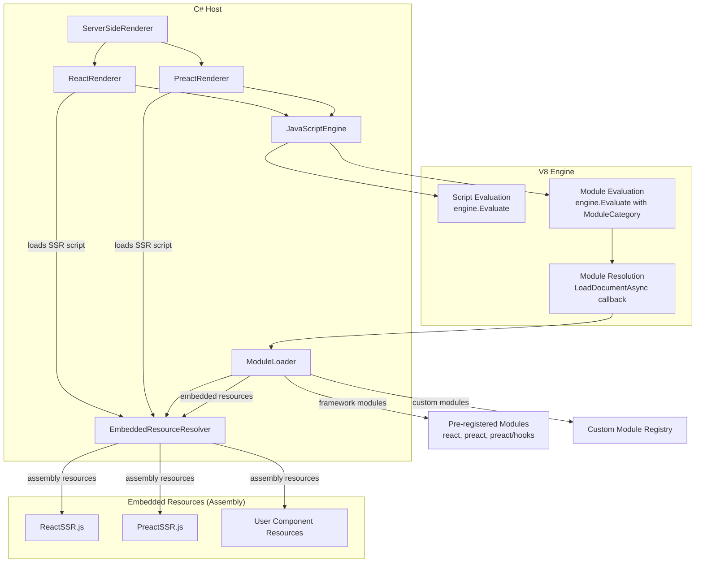
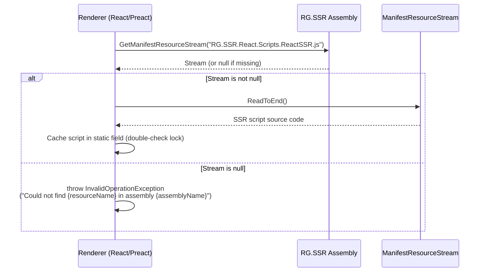
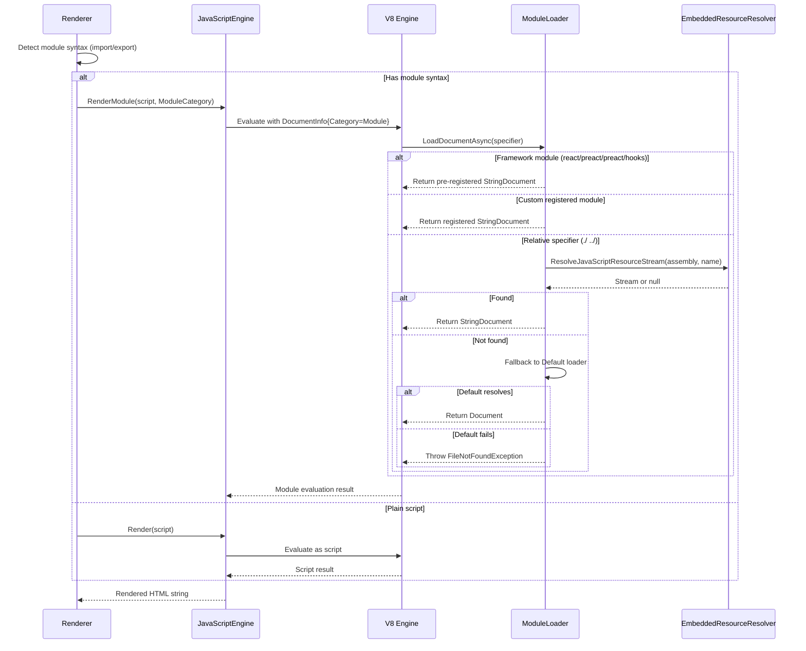

# Design Document: ES Module Support

## Overview

This design adds ES module (ESM) support to RG.SSR, enabling component files to use `import`/`export` syntax while maintaining full backward compatibility with existing plain-script components. The implementation leverages ClearScript's built-in V8 module loading infrastructure (`DocumentLoader`, `DocumentCategory.Script` vs module category, `StringDocument`) to resolve and evaluate ES modules server-side.

The key architectural change is enhancing the existing `ModuleLoader` to handle assembly-scoped embedded resource resolution, pre-registering framework modules (react, preact, preact/hooks) as synthetic ES modules, and modifying the renderers to detect module syntax and switch between script evaluation and module evaluation accordingly.

## Architecture



### SSR Script Loading from Embedded Resources

All internal JavaScript scripts (ReactSSR.js, PreactSSR.js, and any future internal scripts) are loaded exclusively from embedded resources compiled into the RG.SSR assembly. The renderers never perform filesystem I/O or construct JavaScript source from inline C# string literals. This ensures the library is fully self-contained and deployment-environment agnostic.



**Design Decision**: The SSR scripts are loaded via `Assembly.GetExecutingAssembly().GetManifestResourceStream(...)` with a fully-qualified resource name (e.g., `"RG.SSR.React.Scripts.ReactSSR.js"`). The result is cached in a static field using double-checked locking so the embedded resource is read exactly once per application lifetime. If the resource stream is null (indicating the resource was not embedded at build time), the renderer throws `InvalidOperationException` immediately rather than proceeding with a null or empty script.

### Module Resolution Flow



### Design Decisions

1. **Detection-based routing**: The renderer inspects component source for `import`/`export` statements (using regex that excludes comments and string literals) to decide between script and module evaluation. This avoids requiring configuration changes from users.

2. **Assembly-scoped resolution**: The `ModuleLoader` receives the component assembly reference during rendering so it can resolve relative imports against that assembly's embedded resources. This is passed via a thread-local or scoped context since `LoadDocumentAsync` doesn't accept custom state.

3. **Immutable custom module registration**: Custom modules registered via `RegisterModule` are write-once. The first registration wins, matching the semantics of ES module caching where a module identity is fixed once loaded.

4. **SSR script as module**: The SSR helper script (ReactSSR.js / PreactSSR.js) is pre-registered as a framework module so component modules can implicitly access `render()` via the evaluation wrapper, or the renderer wraps the component invocation in a top-level module that imports both the SSR utilities and the component.

## Components and Interfaces

### ModuleLoader (Enhanced)

```csharp
internal sealed class ModuleLoader : DocumentLoader
{
    // Existing
    private readonly ConcurrentDictionary<string, Document> _moduleByName;
    
    // New: custom module registry (immutable after first registration)
    private readonly ConcurrentDictionary<string, Document> _customModules;
    
    // New: assembly context for resolving relative imports
    private Assembly? _currentComponentAssembly;
    private readonly object _assemblyContextLock = new();

    // Existing method (unchanged signature)
    public string GetOrAddModule(string name, Func<(string Code, DocumentCategory Category)> valueFactory);

    // New: Register a custom module by specifier name
    public void RegisterModule(string specifier, string sourceCode);

    // New: Set the assembly context for the current render operation
    public void SetComponentAssembly(Assembly assembly);
    
    // New: Clear the assembly context after render
    public void ClearComponentAssembly();

    // Enhanced: LoadDocumentAsync with embedded resource resolution
    public override Task<Document> LoadDocumentAsync(
        DocumentSettings settings,
        DocumentInfo? sourceInfo,
        string specifier,
        DocumentCategory category,
        DocumentContextCallback contextCallback);
}
```

### JavaScriptEngine (Enhanced)

```csharp
internal sealed class JavaScriptEngine : IDisposable
{
    // Existing
    public string Render(string script);
    public string RenderModule(string module, DocumentCategory category);
    
    // New: Render a module with assembly context for import resolution
    public string RenderModule(string moduleCode, Assembly componentAssembly);
}
```

### ModuleSyntaxDetector (New)

```csharp
internal static class ModuleSyntaxDetector
{
    /// <summary>
    /// Determines whether the given JavaScript source contains ES module syntax
    /// (import/export statements) outside of comments and string literals.
    /// </summary>
    public static bool ContainsModuleSyntax(string source);
}
```

### IReactRenderer / IPreactRenderer (Unchanged)

The public interfaces remain identical:
```csharp
public interface IReactRenderer
{
    string Render(Assembly componentAssembly, string componentName, bool isStatic);
    string Render<TProps>(Assembly componentAssembly, string componentName, TProps props, bool isStatic);
}
```

### ReactRenderer / PreactRenderer (Enhanced internally)

Internal changes:
- Detect module syntax in component source
- For ES modules: construct a wrapper module that imports the SSR script and the component, invokes the component, and calls `render()`
- For ES modules with `isStatic=false`: emit `<script type="module">` for hydration instead of `<script defer>`
- For plain scripts: behavior unchanged

**SSR Script Loading (Requirement 9)**:
- Each renderer loads its SSR script exclusively from an embedded resource in the RG.SSR assembly
- `ReactRenderer.GetSsrScript()` reads `"RG.SSR.React.Scripts.ReactSSR.js"` via `Assembly.GetExecutingAssembly().GetManifestResourceStream(...)`
- `PreactRenderer.GetSsrScript()` reads `"RG.SSR.Preact.Scripts.PreactSSR.js"` via `Assembly.GetExecutingAssembly().GetManifestResourceStream(...)`
- The loaded script is cached in a static field with double-checked locking (read once per app lifetime)
- If the resource stream is null, the renderer throws `InvalidOperationException` with the missing resource name and assembly name
- No filesystem I/O (`File.ReadAllText`, `StreamReader` on file paths) or inline string construction is used for internal scripts

### Framework Module Registration

Pre-registered at `ModuleLoader` construction time:

| Specifier | Exports |
|-----------|---------|
| `preact` | `createElement`, `useState`, `useEffect`, `useContext`, `useReducer`, `useCallback`, `useMemo`, `useRef` |
| `preact/hooks` | `useState`, `useEffect`, `useReducer`, `useCallback`, `useMemo`, `useRef`, `useContext` |
| `react` | `createElement`, `useState`, `useEffect`, `useContext`, `useReducer`, `useCallback`, `useMemo`, `useRef` |

## Data Models

### Module Resolution Priority

When `LoadDocumentAsync` is called with a specifier, resolution follows this order:

1. **Framework modules** — exact match against pre-registered specifiers (`react`, `preact`, `preact/hooks`)
2. **Custom registered modules** — exact match against programmatically registered specifiers
3. **Cached modules** — previously resolved modules in `_moduleByName`
4. **Embedded resource resolution** (for relative specifiers `./` or `../`):
   - Strip path prefix, extract filename
   - Search component assembly resources using `EmbeddedResourceResolver` suffix-matching logic:
     - Prefer `.min.js` suffix match
     - Then `.js` suffix match
     - Then exact name match
5. **ClearScript default loader** — fallback delegation
6. **Error** — throw `FileNotFoundException` with specifier and assembly name

### Module Syntax Detection Rules

A component file is classified as an ES module if it contains any of these patterns **outside** of comments (`//`, `/* */`) and string literals (`'...'`, `"..."`, `` `...` ``):

- `import` followed by whitespace or `{` or `"` or `'`
- `export` followed by whitespace and then `default`, `function`, `class`, `const`, `let`, `var`, or `{`

### Hydration Script Model

| Condition | Script Tag Type | Content |
|-----------|----------------|---------|
| ES module component, `isStatic=false` | `<script type="module">` | `import` component, call hydrate |
| Plain script component, `isStatic=false` | `<script defer>` | Inline component, call hydrate |
| Any component, `isStatic=true` | None | Only server-rendered HTML |

### Custom Module Registration Constraints

| Parameter | Constraint |
|-----------|-----------|
| `specifier` | Non-null, non-empty, max 256 characters |
| `sourceCode` | Non-null, non-empty |
| Duplicate specifier | Silently ignored (first registration wins) |


## Example Consumer Project Structure

This example shows how a typical ASP.NET MVC project using RG.SSR with ES modules would organize its cshtml views, jsx component files, and shared modules — all compiled as embedded resources in the web application assembly.

```
MyApp/
├── MyApp.csproj                          ← EmbeddedResource includes for Views/**/*.js
├── Program.cs
├── Controllers/
│   ├── HomeController.cs
│   └── ProductController.cs
├── Views/
│   ├── Home/
│   │   ├── Index.cshtml                  ← Razor view, calls @Html.RenderComponent("Index")
│   │   ├── Index.jsx                     ← Source JSX (compiled to Index.js)
│   │   ├── Index.js                      ← ES module: import { formatDate } from './utils.js'
│   │   │                                    export default function Index(props) { ... }
│   │   ├── Dashboard.cshtml
│   │   ├── Dashboard.jsx
│   │   └── Dashboard.js                  ← ES module: import Header from './shared/Header.js'
│   ├── Product/
│   │   ├── Detail.cshtml
│   │   ├── Detail.jsx
│   │   ├── Detail.js                     ← ES module: import { formatPrice } from './shared/formatting.js'
│   │   ├── List.cshtml
│   │   ├── List.jsx
│   │   └── List.js                       ← ES module: import ProductCard from './shared/ProductCard.js'
│   └── Shared/
│       ├── _Layout.cshtml
│       └── Error.cshtml
├── Components/
│   └── Shared/                           ← Shared JS modules (embedded resources)
│       ├── Header.js                     ← export default function Header(props) { ... }
│       ├── Footer.js                     ← export default function Footer(props) { ... }
│       ├── ProductCard.js                ← import { formatPrice } from './formatting.js'
│       │                                    export default function ProductCard(props) { ... }
│       ├── formatting.js                 ← export function formatPrice(n) { ... }
│       │                                    export function formatDate(d) { ... }
│       └── constants.js                  ← export const API_BASE = '/api/v1'
└── wwwroot/
    ├── css/
    └── js/                               ← Client-side bundles (NOT used for SSR)
```

### .csproj Embedded Resource Configuration

```xml
<Project Sdk="Microsoft.NET.Sdk.Web">
  <ItemGroup>
    <!-- Component modules and shared modules as embedded resources -->
    <EmbeddedResource Include="Views\**\*.js" />
    <EmbeddedResource Include="Components\**\*.js" />
  </ItemGroup>
</Project>
```

### How Imports Resolve

| Component File | Import Statement | Resolves To |
|---------------|-----------------|-------------|
| `Views/Home/Index.js` | `import { formatDate } from './utils.js'` | Embedded resource matching `utils.js` suffix in same assembly |
| `Views/Home/Dashboard.js` | `import Header from './shared/Header.js'` | `Components/Shared/Header.js` embedded resource (suffix match) |
| `Views/Product/Detail.js` | `import { formatPrice } from './shared/formatting.js'` | `Components/Shared/formatting.js` embedded resource |
| `Views/Product/List.js` | `import ProductCard from './shared/ProductCard.js'` | `Components/Shared/ProductCard.js` embedded resource |
| `Components/Shared/ProductCard.js` | `import { formatPrice } from './formatting.js'` | `Components/Shared/formatting.js` (transitive dependency) |
| Any component | `import { createElement } from 'preact'` | Pre-registered framework module (mock SSR implementation) |

### Rendering Flow Example

In `HomeController.cs`:
```csharp
public IActionResult Index()
{
    return View(); // renders Index.cshtml
}
```

In `Views/Home/Index.cshtml`:
```html
@using RG.SSR
@inject IPreactRenderer Ssr

<div>
    @Html.Raw(Ssr.Render<IndexProps>(
        typeof(HomeController).Assembly,  <!-- assembly containing embedded JS -->
        "Index",                           <!-- component name (matches export) -->
        new IndexProps { Title = "Welcome" },
        isStatic: false))
</div>
```

In `Views/Home/Index.js` (embedded resource):
```javascript
import { createElement } from 'preact';
import { formatDate } from './formatting.js';
import Header from './shared/Header.js';

export default function Index(props) {
    return createElement('div', null,
        createElement(Header, { title: props.Title }),
        createElement('p', null, `Today is ${formatDate(new Date())}`)
    );
}
```

## Correctness Properties

*A property is a characteristic or behavior that should hold true across all valid executions of a system — essentially, a formal statement about what the system should do. Properties serve as the bridge between human-readable specifications and machine-verifiable correctness guarantees.*

### Property 1: Module Evaluation Equivalence

*For any* valid component function and props, rendering the component as a plain script (via `engine.Evaluate`) and as an ES module (via module evaluation with `export default`) SHALL produce identical HTML output.

**Validates: Requirements 1.4, 6.2**

### Property 2: Module Syntax Detection Accuracy

*For any* JavaScript source string, the `ModuleSyntaxDetector.ContainsModuleSyntax` function SHALL return `true` if and only if the source contains `import` or `export` statements as actual JavaScript statements — returning `false` when those keywords appear only within single-line comments (`//`), multi-line comments (`/* */`), single-quoted strings, double-quoted strings, or template literals.

**Validates: Requirements 6.1, 6.5**

### Property 3: Relative Specifier Suffix-Matching Resolution Priority

*For any* assembly containing embedded resources and a relative module specifier (starting with `./` or `../`), the `ModuleLoader` SHALL resolve to the resource matching the specifier's filename with `.min.js` suffix if available, otherwise `.js` suffix if available, otherwise exact name match — following a strict priority order.

**Validates: Requirements 2.1**

### Property 4: Bare Specifier Resolution to Registered Module

*For any* non-empty specifier string registered in the module loader and any component that imports that specifier, the `ModuleLoader.LoadDocumentAsync` SHALL return a document whose contents match the registered source code.

**Validates: Requirements 2.2, 5.2**

### Property 5: Immutable Module Registration

*For any* specifier string S, if a module is registered with specifier S and source code A, then a subsequent registration with specifier S and source code B SHALL be silently ignored, and importing S SHALL always return source A.

**Validates: Requirements 5.3**

### Property 6: Module Instance Identity

*For any* module specifier imported by two or more different modules within the same evaluation, the `ModuleLoader` SHALL return the same module instance such that exported object references are identical across all importers.

**Validates: Requirements 4.3**

### Property 7: Hydration Script Tag Type

*For any* component rendered with `isStatic=false`, if the component source contains ES module syntax then the hydration script SHALL be emitted within a `<script type="module">` tag, and if the component source does not contain ES module syntax then the hydration script SHALL be emitted within a `<script defer>` tag.

**Validates: Requirements 7.2, 7.3**

### Property 8: Static Rendering Produces No Scripts

*For any* component (whether ES module or plain script) rendered with `isStatic=true`, the output SHALL contain no `<script` tags and no container `<div>` wrapper — only the server-rendered HTML content.

**Validates: Requirements 7.4**

### Property 9: Error Reporting for Unresolvable Specifiers

*For any* module specifier that cannot be resolved to a framework module, custom registered module, embedded resource, or via the default loader fallback, the thrown exception message SHALL contain both the unresolved specifier string and the full name of the assembly that was searched.

**Validates: Requirements 2.3, 8.1, 8.4**

### Property 10: SSR Mock Implementations

*For any* initial state value, `useState` SHALL return a tuple of `[initialState, noopFunction]`. *For any* tag, props, and children arguments, `createElement` SHALL return an object `{tag, props, children}`. *For any* factory function, `useMemo` SHALL return the result of invoking that factory. *For any* callback function, `useCallback` SHALL return the callback unchanged.

**Validates: Requirements 3.4**

### Property 11: Missing Export Error

*For any* ES module that does not contain a default export and does not contain a named export matching the requested component name, the JavaScript engine SHALL throw an error whose message indicates that no valid component export was found.

**Validates: Requirements 1.3**

### Property 12: Missing SSR Script Embedded Resource Error

*For any* renderer (React or Preact), if the expected internal SSR script embedded resource (e.g., `"RG.SSR.React.Scripts.ReactSSR.js"` or `"RG.SSR.Preact.Scripts.PreactSSR.js"`) cannot be found in the assembly at runtime, the renderer SHALL throw an `InvalidOperationException` whose message contains both the missing resource name and the name of the assembly that was searched.

**Validates: Requirements 9.4**

## Error Handling

### Module Resolution Errors

| Error Condition | Exception Type | Message Content |
|----------------|---------------|-----------------|
| Specifier not found in any source | `FileNotFoundException` | Specifier value + assembly full name |
| Specifier not found + fallback fails | `FileNotFoundException` | Specifier value + assembly name + list of available resource names |
| No valid export in module | `InvalidOperationException` | Component name + "no valid component export was found" |
| Syntax error in module | `ScriptEngineException` (from ClearScript) | 1-based line number + syntax violation description |
| Null/empty specifier for registration | `ArgumentException` | Parameter name "specifier" |
| Null/empty source for registration | `ArgumentException` | Parameter name "sourceCode" |
| SSR script embedded resource missing | `InvalidOperationException` | Missing resource name (e.g., "RG.SSR.React.Scripts.ReactSSR.js") + assembly full name |

### Error Propagation Strategy

1. **Module resolution errors** bubble up through ClearScript's `LoadDocumentAsync` as exceptions, which V8 converts to JavaScript errors, which ClearScript then re-throws as `ScriptEngineException`. The `ModuleLoader` wraps resolution failures in `FileNotFoundException` before they reach V8.

2. **Syntax errors** are reported by V8 itself during module parsing. ClearScript surfaces these as `ScriptEngineException` with line/column information preserved.

3. **Missing export errors** are detected by the renderer's wrapper module code. The wrapper module attempts to access the expected export and throws if it's undefined.

4. **Registration validation errors** are thrown immediately from `RegisterModule` before any V8 interaction.

### Circular Dependency Handling

Circular dependencies are handled by V8's ES module specification implementation:
- Already-evaluated exports are available to the importing module
- Not-yet-evaluated exports appear as `undefined`
- No exception is thrown
- No infinite loop occurs

This is standard ES module semantics and requires no custom handling in the `ModuleLoader`.

## Testing Strategy

### Property-Based Testing

**Library**: [FsCheck](https://fscheck.github.io/FsCheck/) for .NET (C# integration via `FsCheck.Xunit`)

Property-based tests will validate the 12 correctness properties defined above. Each test will:
- Run a minimum of 100 iterations with randomly generated inputs
- Be tagged with a comment referencing the design property
- Tag format: `// Feature: es-module-support, Property {number}: {property_text}`

**Key generators needed**:
- Valid JavaScript function bodies (for component generation)
- Module specifier strings (relative paths, bare names, framework names)
- Assembly resource name sets (with various suffix combinations)
- JavaScript source with import/export in various positions (statements, comments, strings)
- Props objects (random JSON-serializable structures)

### Unit Tests (Example-Based)

| Area | Test Cases |
|------|-----------|
| Framework module exports | Verify `preact`, `preact/hooks`, `react` each export the exact set of named functions |
| Default export invocation | Component with `export default function Foo()` renders correctly |
| Named export invocation | Component with `export function Foo()` renders correctly |
| Syntax error reporting | Module with error at line 3 reports line 3 in exception |
| Registration validation | Null specifier, empty specifier, null source, empty source all throw `ArgumentException` |
| Options backward compat | All option classes retain default values |
| Circular dependency | A↔B circular import resolves without exception |
| SSR script embedded resource | ReactSSR.js and PreactSSR.js are present in assembly manifest resources |
| SSR script no filesystem I/O | Render pipeline does not open FileStream or call File.* methods for internal scripts |

### Integration Tests

| Area | Test Cases |
|------|-----------|
| 3-level dependency graph | Component → utility → helper, all resolve and render correctly |
| Default loader fallback | Specifier not in embedded resources delegates to ClearScript default |
| Full render pipeline | ES module component with imports renders same HTML as equivalent plain script |
| Hydration output | Verify complete HTML structure including div ID, script tags, and hydrate calls |

### Test Project Structure

```
RG.SSR.Tests/
├── Properties/
│   ├── ModuleSyntaxDetectorProperties.cs    (Property 2)
│   ├── ModuleResolutionProperties.cs        (Properties 3, 4, 5, 6)
│   ├── RenderEquivalenceProperties.cs       (Property 1)
│   ├── HydrationOutputProperties.cs         (Properties 7, 8)
│   ├── ErrorReportingProperties.cs          (Properties 9, 11, 12)
│   └── MockImplementationProperties.cs      (Property 10)
├── Unit/
│   ├── ModuleLoaderTests.cs
│   ├── ModuleSyntaxDetectorTests.cs
│   ├── ReactRendererModuleTests.cs
│   └── PreactRendererModuleTests.cs
└── Integration/
    ├── TransitiveDependencyTests.cs
    ├── FrameworkModuleTests.cs
    └── FullRenderPipelineTests.cs
```
